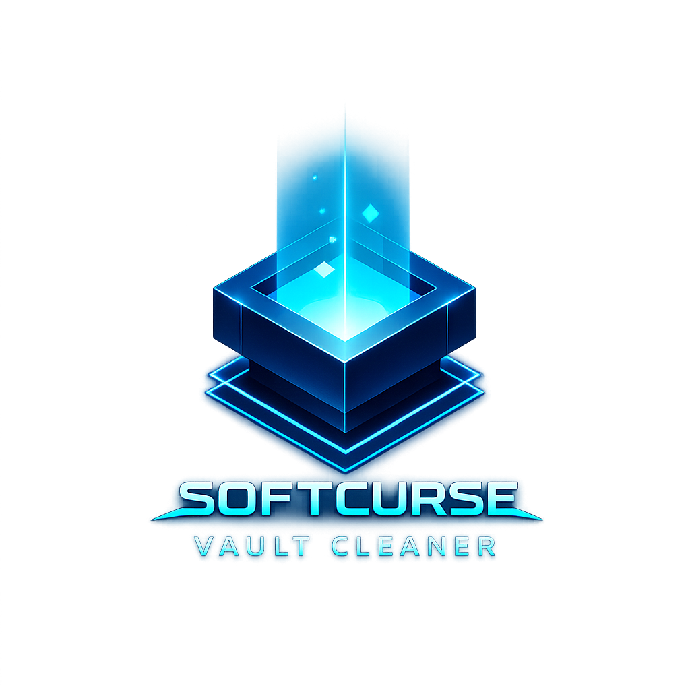

<p align="center">
  <a href="https://softcursesystems.pages.dev/lab/vault">
    
  </a>
</p>

<h1 align="center">Softcurse Vault Cleaner</h1>

<p align="center">
  A Windows cleanup and disk-analysis application created by
  <a href="https://softcursesystems.pages.dev">Softcurse Systems</a>.
</p>

<p align="center">
  <a href="https://softcursesystems.pages.dev/lab/vault">Application page</a> ·
  <a href="https://softcursesystems.pages.dev">Softcurse Systems</a> ·
  <a href="LICENSE">Apache-2.0 license</a>
</p>

Softcurse Vault Engine is an advanced WPF-based toolkit designed to purge, analyze, and optimize Windows environments.  
Forged with dark neon aesthetics and powered by modular architecture, the Engine provides deep cleanup, disk analysis, and system-level utilities with precision and style.

---

# 🌑 Core Modules

## 1. Vault Cleaner
Standard-user cleanup subsystem that previews narrowly scoped, recoverable file operations.

### Features
- **Recycle Bin Purge**
- **User TEMP Cleanup**
- **Browser Cache Removal** (Chrome, Edge, Firefox, Brave)
- **UWP Temporary-State Cleanup**
- **Python PIP Cache Cleanup**
- **Per-user Graphics Driver Cache Cleanup** (NVIDIA, AMD, Intel)
- **Unreal Engine Derived Data Cache Cleanup**
- **Android SDK System Image Cleanup**
- **DISM Component Store Cleanup** through a fixed, separately elevated helper (no ResetBase)
- **Thumbnail Cache Cleanup**

### Advanced Capabilities
- **Quick Scan** — Estimate recoverable space
- **Exact Target Preview** — Review paths, risk, privilege, and estimated size before execution
- **Protected-Path Validation** — Reject roots, protected folders, junctions, and mount points
- **Recoverable Deletion** — Filesystem targets are sent to the Recycle Bin
- **Detailed Progress & UI Feedback**
- **Full Logging Pipeline** (`D:\VaultHunterLogs`)
- **Async operations** (UI never freezes)

---

## 2. WinDir Disk Analyzer
A standalone subsystem for deep disk inspection, visual analysis, and file forensics.

### Key Features
- **Full filesystem tree scan**
- **Top Files Explorer**
- **Top Directories Analysis**
- **Extension-Based Category Mapping**
- **Duplicate Finder**
- **Large File Hunter**
- **Aged File Analysis**
- **Real-time scan progress with circular neon indicator**
- **Detailed recommendations output**
- **Standalone HTML report generation**

WinDir opens as an independent vault window while inheriting the main UI theme.

---

# 🔧 Architecture Overview

Softcurse Vault Engine is fully modular and future-proof, built with the following principles:

### ✔ MVVM Pattern  
Strict ViewModel-driven architecture ensures clean separation of UI and logic.

### ✔ Independent Subsystems  
Cleaner, Disk Analyzer, and future modules run in isolation.

### ✔ Shared UI Theme  
A global resource dictionary unifies the application's neon aesthetic across all windows.

### ✔ Async/Task-Based Engine  
Long-running operations never block the UI thread.

### ✔ Global Logging Layer  
All modules write into the Softcurse Vault log system.

---

# 🧩 Planned Modules (v3.x Roadmap)

- **Startup & Services Manager**
- **Deep Uninstaller**
- **System Optimizer Panel (Tweaks)**
- **Network Insight Tool**
- **Disk Health & SMART Monitor**
- **Registry Backup & Cleanup**
- **AppData Forensics Scanner**

Each module is implemented as a standalone vault window using the shared Softcurse theme.

---

# 🖥 Requirements

- **64-bit Windows 10 or Windows 11**
- **Microsoft Edge WebView2 Evergreen Runtime** for animated loaders; cleanup remains usable without it
- **Standard-user account**; UAC is requested only for optional Windows component cleanup
- **Approximately 250 MB disk space** for the self-contained x64 release

---

# 🛠 Building From Source

### Prerequisites
1. Install the **.NET 10.0.400 SDK** selected by `global.json`
2. Install **Visual Studio 2022** (or VS Code with C# extensions)

Package versions are centralized in `Directory.Packages.props`, and locked restore files are committed for repeatable builds.

### Build

```powershell
cd "Win11 Auto-Clean"
dotnet restore "Win11 Auto-Clean.sln"
dotnet build "Win11 Auto-Clean.sln" --configuration Release
dotnet run --project "Win11 Auto-Clean.csproj"
```

### Output

```
bin/Release/net10.0-windows/Win11 Auto-Clean.exe
```

### Safety verification

```powershell
dotnet restore "Win11 Auto-Clean.sln" --locked-mode
dotnet build "Win11 Auto-Clean.sln" --configuration Release --no-restore -warnaserror
dotnet run --project "SafeCleanupEngine.Tests/SafeCleanupEngine.Tests.csproj" --configuration Release --no-build
./scripts/Test-ReleaseIntegrity.ps1
```

Routine cleanup testing uses randomized temporary-directory fixtures and injected system-operation fakes in `SafeCleanupEngine.Tests`. The suite exercises path normalization, protected locations, non-`C:` layouts, link/junction rejection, cancellation, partial failures, duplicate detection, recoverable deletion policy, and update verification without touching real system data. GitHub Actions runs it on an ephemeral Windows runner and can also be started manually from the Actions page.

The fail-closed Hyper-V harness in [tests/vm/README.md](tests/vm/README.md) is optional release-hardening infrastructure only. It is not required for routine development and must never be run against a developer workstation.

---

# 🔐 Licensing and Releases

All current application features are available without a license key. The former placeholder subscription flow was removed because it did not provide real server-backed entitlement validation.

Production releases are built only from a clean, exact version tag. The release pipeline creates a self-contained Windows x64 build, signs and timestamps executables and the installer, generates an SBOM and checksums, and publishes provenance. Update metadata is RSA-signed; downloaded installers must also match the signed size and SHA-256 digest, pass Windows Authenticode verification, and match the pinned signer certificate.

The update channel deliberately fails closed until production trust anchors and CI signing secrets are provisioned. See [RELEASE.md](RELEASE.md) for the release procedure.

Security reports and local-data handling are documented in [SECURITY.md](SECURITY.md) and [PRIVACY.md](PRIVACY.md).

---

# 🧭 Usage

### Vault Cleaner

1. Launch normally as a standard user
2. Configure cleanup options
3. Run **Quick Scan**
4. Run **Initiate Cleanup Protocol**
5. Review freed storage and logs

### WinDir Disk Analyzer

1. Open **Disk Analyzer** tab
2. Select drive or folder
3. Choose **Quick** or **Deep scan**
4. Watch neon circular progress indicator
5. Browse results or export HTML report

---

# ⚠ Safety Guidelines

* Always review the exact confirmation preview before cleanup
* Filesystem cleanup is sent to the Recycle Bin, but emptying the Recycle Bin itself is not reversible
* Protected system locations and unsafe custom roots are blocked
* Windows component cleanup is the only operation that requests UAC

---

# 📄 Logs

All operations are logged:

```
D:\VaultHunterLogs\vault-cleaner-YYYYMMDD-HHmmss.log
D:\VaultHunterLogs\widir-YYYYMMDD-HHmmss.log
```

Error logs:

```
D:\VaultHunterLogs\errors\*.log
```

---

# 🏗 Project Structure

```
VaultEngine/
├── App.xaml
├── MainWindow.xaml
├── MainWindowViewModel.cs
├── Modules/
│   ├── Cleaner/
│   │   ├── CleanerService.cs
│   │   ├── CleanerView.xaml
│   ├── WinDir/
│   │   ├── WinDirWindow.xaml
│   │   ├── TreeBuilder.cs
│   │   ├── Aggregator.cs
│   │   ├── HtmlReportBuilder.cs
│   │   ├── Models/
│   │   │   ├── FSNode.cs
│   │   │   ├── DuplicateItem.cs
│   │   │   ├── LargeFileItem.cs
│   │   │   ├── ExtensionStats.cs
│   ├── Shared/
│       ├── Controls/
│       ├── Themes/
│       ├── Helpers/
└── VaultEngine.csproj
```

---

# 🧬 Version History

### **v3.0 (Current — Softcurse Vault Engine)**

* Renamed project to Vault Engine
* Added full WinDir Disk Analyzer subsystem
* Added neon circular progress indicator
* Added duplicate finder & large file hunter
* Modular architecture introduced
* Shared UI theme system added

### **v2.2 (Old — Vault Cleaner)**

* MVVM refactor
* CleanerService abstraction
* Quick Scan
* Improved error handling

---

# 💀 Credits

**Softcurse Vault Engine**
Forged in WPF (.NET 10) using MVVM and dark neon aesthetics.

```
